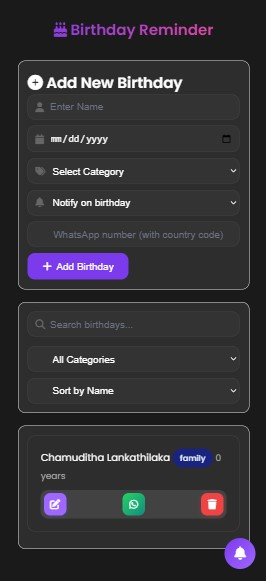
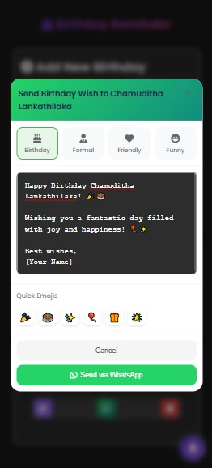

  
  
  # 🎂 Birthday Reminder App
  
  A modern WhatsApp birthday reminder application with customizable messages and notifications.
  
  
  
  

## ✨ Features

- 🔔 Birthday notifications
- 💬 WhatsApp message integration
- 📝 Customizable message templates
- 🎨 Modern UI design
- 📱 Mobile responsive
- 🌐 Cross-browser compatible

## 🖥️ Screenshots

  
  

## 🚀 Getting Started

### Prerequisites

- Web browser (Chrome, Firefox, Safari, etc.)
- Internet connection for WhatsApp integration

### Installation

1. Clone the repository: 
